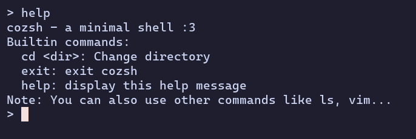

# cozsh - a minimal shell

cozsh is a simple and **very** minimal shell built in C with only 145
lines of code (including comments)

Feel free to use this as a learning resource or a starting point for your own shell :3



## Installation

```bash
sudo make clean install
```

## Usage

Start the shell by running `cozsh` in a terminal. You can exit the shell by typing `exit`.
